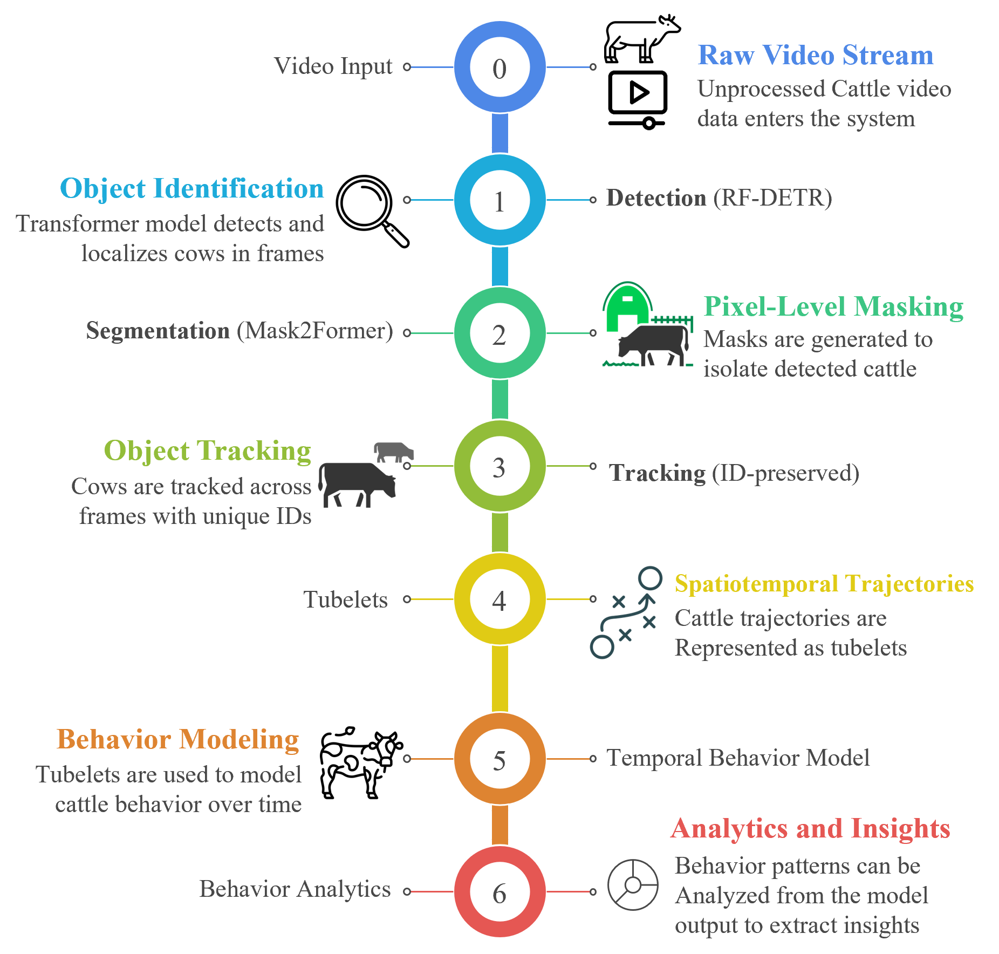
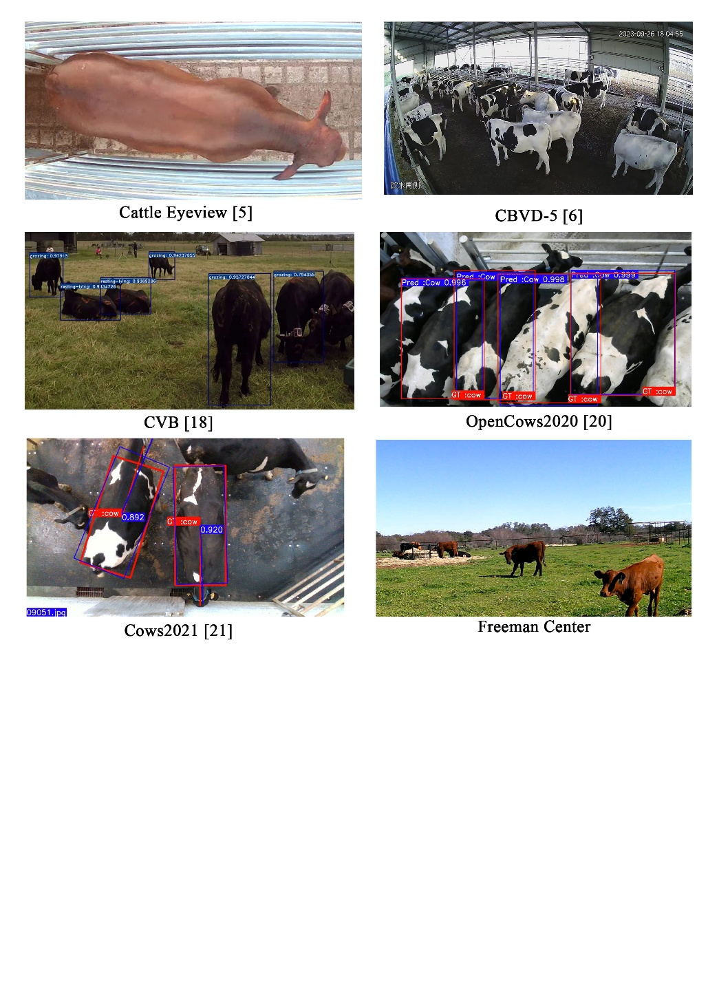

A TRANSFORMER-BASED PERCEPTION AND ANALYTICS FRAMEWORK FOR CATTLE BEHAVIOR ANALYSIS ACROSS DIVERSE RANCH ENVIRONMENTS

by

Md Sakif Uddin Khan, B.S

A thesis proposal submitted to the Graduate Council of

Texas State University in partial fulfillment

of the requirements for the degree of

Master of Science

with a Major in Mechanical and Manufacturing Engineering

January 20, 2026

Committee Members:

Dr. Damian Valles Molina, Chair

Dr. Bahram Asiabanpour

Dr. Merritt Drewery

**COPYRIGHT**

by

Md Sakif Uddin Khan

2026

**DEDICATION**

**ACKNOWLEDGMENTS**

This work was supported by the USDA NIFA under Grant 2023-77040-41262.

# TABLE OF CONTENTS

# LIST OF TABLES

# LIST OF FIGURES

# LIST OF ABBREVIATIONS

| AI | Artificial Intelligence |
| --- | --- |
| AVA | Atomic Visual Actions |
| CNN | Convolutional Neural Network |
| CV | Computer Vision |
| CVB | Cattle Visual Behavior Dataset |
| DL | Deep Learning |
| HOTA | Higher Order Tracking Accuracy |
| ID | Identity |
| IoU | Intersection over Union |
| MOT | Multi-Object Tracking |
| OOD | Out-of-Distribution |
| ReID | Re-Identification |
| SAM | Segment Anything Model |
| SOTA | State of the Art |
| ViT | Vision Transformer |
|  |  |

# ABSTRACT

Cattle behavior provides important information about animal health and welfare. Vision-based monitoring systems provide a non-contact means of observing these behaviors at scale. However, most existing systems are designed for controlled settings and perform poorly when applied to new ranch environments. Variations in lighting, weather, camera viewpoint, and scene layout often lead to performance degradation. This thesis investigates whether a unified computer vision framework can support reliable cattle behavior analysis across diverse ranch conditions without environment-specific retraining. The proposed system integrates detection, instance segmentation, multi-object tracking, and temporal behavior recognition into a single perception pipeline. Transformer-based models are used where global spatial or temporal context is required, while the overall design remains modular and dataset-driven. Identity-preserved animal tracks are used to generate per-animal temporal sequences for behavior recognition. A central contribution of this work is an explicit generalization and robustness evaluation layer. Performance is analyzed under both in-domain and out-of-distribution conditions using cross-dataset testing and controlled environmental perturbations. This approach focuses on measuring performance degradation rather than claiming robustness. Beyond behavior classification, the system produces behavior timelines and activity summaries for individual animals. These analytics provide insights into grazing, resting, and movement patterns. The proposed framework emphasizes measurement, interpretability, and practical relevance for long-term monitoring of cattle.

# I. INTRODUCTION

## 1.1 Background and Motivation

Cattle behavior is an important indicator of animal health, welfare, and productivity. Changes in feeding, resting, movement, or social interaction often appear before visible clinical symptoms. Monitoring these behaviors supports early intervention and informed management decisions [1]. Manual observation is still widely used in ranch settings. However, it is time-consuming, subjective, and difficult to scale to large herds or long observation periods. Sensor-based approaches provide useful signals, but they require installation, maintenance, and direct animal contact, which may limit practicality [2]. Vision-based systems offer a non-intrusive alternative. Cameras can monitor multiple animals simultaneously and operate continuously over long periods. Recent advances in transformer-based vision models further strengthen this opportunity. Unlike earlier convolutional approaches, transformers can model global spatial and temporal context, which is critical for crowded scenes, long-duration behaviors, and identity consistency over time [3]. These properties make transformer-based models well suited to integrated cattle monitoring systems that require detection, tracking, and behavior analysis across extended time horizons and varying environments.

## 1.2 Challenges in Vision-Based Cattle Behavior Analysis

Vision-based analysis of cattle behavior faces several challenges. Cattle often share similar coloration, size, and shape, which makes individual identification difficult. Occlusion is common when animals cluster during feeding or resting, leading to frequent identity confusion [1]. Environmental diversity further complicates analysis. Many existing systems are developed in controlled indoor settings and experience performance degradation when applied to outdoor or pasture environments. Variations in lighting, weather, background, and camera viewpoint introduce pronounced visual shifts that traditional models struggle to handle [4], [5]. Dataset-related challenges are also prominent. Existing cattle vision datasets are fragmented and employ inconsistent definitions of behavior and annotation styles. These inconsistencies limit the ability to train and evaluate models across environments [6].

Although transformer-based models have shown improved robustness to occlusion and long-range dependencies, prior livestock studies often apply them to isolated tasks rather than full systems. As a result, their potential to address these challenges at the pipeline level remains underexplored. Generalization, therefore, remains weak in much of the prior work. Many systems perform well on a single dataset but exhibit substantial performance declines under new environmental conditions [7].

## 1.3 Problem Statement

Despite advances in vision-based livestock monitoring, a unified, generalizable vision pipeline for cattle behavior analysis remains lacking. Existing approaches typically develop detection, tracking, or behavior recognition as separate components. Transformer-based models are often introduced at a single stage, without evaluating their effect on system-level reliability [8]. There is also a limited dataset-centric evaluation across environments. Models are rarely tested under explicit cross-dataset or out-of-distribution conditions, even when transformer architectures are used. This limits understanding of when and why such models fail [7].

In addition, most systems prioritize detection or classification accuracy rather than behavior analytics. Without identity-preserved temporal modeling, it remains difficult to produce interpretable behavior timelines that are meaningful for long-term monitoring [1].

## 1.4 Research Objectives

The primary objective of this research is to develop and evaluate a **unified transformer-based vision framework** for cattle behavior analysis that can operate across diverse ranch environments. The specific objectives are to:

Harmonize multiple cattle behavior datasets into a unified structure

Design a unified perception pipeline that uses transformer-based models for detection, segmentation, tracking, and temporal modeling

Model cattle behavior using identity-aware, track-based temporal representations

Evaluate generalization explicitly under both in-domain and out-of-distribution conditions

Generate actionable behavior analytics rather than isolated frame-level predictions

These objectives guide the design of the proposed framework and define the expected research contributions, which are presented in the next section.

# II. Background

## 2.1 Cattle Behavior and Vision-Based Monitoring

Cattle behavior reflects health, welfare, and daily activity patterns. Common behaviors of interest include feeding or grazing, resting or lying, walking, and idle standing. Changes in the frequency or duration of these behaviors often indicate stress, illness, or management issues [1].

Traditional behavior monitoring relies heavily on manual observation. While effective at a small scale, this approach is time-consuming and subjective. It does not scale well to large herds or continuous monitoring over long periods. Wearable sensors offer an alternative, but they require physical attachment, maintenance, and calibration, which may limit practicality in open ranch environments [2].

Vision-based monitoring provides a non-intrusive solution. Cameras can observe multiple animals simultaneously and operate continuously without disturbing cattle. Visual data also capture posture, movement, and spatial context, which are important for behavior interpretation. For these reasons, vision-based systems are widely explored for cattle monitoring, particularly in indoor barns and controlled environments [9]. However, vision-based monitoring depends strongly on reliable perception and identity continuity. Without consistent tracking of individual animals, behavior summaries become unreliable. This dependency motivates the use of structured vision pipelines, which are discussed next.

## 2.2 Computer Vision Pipelines for Animal Monitoring

Most vision-based animal monitoring systems follow a multi-stage pipeline. The pipeline typically includes detection, segmentation, tracking, and behavior recognition. Each stage depends on the quality of the previous one. Detection is used to localize animals in each frame. Tracking then associates detections over time to maintain identity continuity. Behavior recognition is usually applied after tracking, either at the frame level or over short temporal windows [1]. Instance segmentation is sometimes included to separate animals at the pixel level. Segmentation improves individual delineation in occluded and crowded scenes, but it is not widely adopted due to annotation costs and computational complexity [10].

Traditional pipelines often break down in complex environments. Outdoor ranch scenes exhibit varied lighting, shadows, background clutter, and frequent occlusion. Tracking-by-detection approaches struggle to preserve identity when animals overlap or leave and re-enter the field of view [4]. Another limitation is fragmentation across tasks. Many studies evaluate detection, tracking, or behavior recognition separately. Error propagation across the full pipeline is rarely analyzed, which limits understanding of system-level reliability [8]. These limitations motivate interest in models that can capture global context and longer temporal dependencies, which has led to increased use of transformers in vision systems.

## 2.3 Transformers in Vision Systems

Transformers were introduced to model long-range dependencies in sequential data. Their attention mechanism allows information to be shared across distant spatial or temporal positions. This property makes transformers suitable for vision tasks involving occlusion, crowded scenes, and long-duration activities [3]. In computer vision, transformers are applied to detection, segmentation, tracking, and video-based behavior recognition. Compared to convolutional models, they better capture global context and temporal relationships. This is particularly relevant for animal monitoring, where identity consistency and behavior duration are critical [11].

Recent studies on livestock have employed transformers for specific tasks, such as tracking or behavior recognition. These models show improved performance under challenging conditions, including occlusion and appearance similarity [12]. However, transformers are best viewed as enabling tools rather than as contributions in themselves. Their effectiveness depends on dataset quality, pipeline integration, and evaluation design. Without system-level analysis and cross-environment evaluation, architectural improvements alone do not guarantee reliable behavior monitoring [7]. In this context, transformers provide technical support for identity-aware perception and temporal modeling. Their role is to strengthen the pipeline rather than define the research contribution.

# III. Literature Review

## 3.1 Vision-Based Cattle Monitoring Systems

Vision-based systems are widely studied for cattle monitoring. Most existing systems focus on detecting cattle and tracking their movement over time to reduce the need for manual observation [1]. Many studies are developed and evaluated in controlled indoor environments such as barns or feeding alleys. Under these conditions, detection and tracking performance are often high [9]. However, these systems are closely tied to their training environment.

Outdoor and pasture environments introduce additional challenges, including background clutter, variation in sunlight, and long viewing distances. Studies evaluating open-ranch scenes report frequent tracking failures and identity switches [4]. As a result, many systems struggle to operate reliably outside controlled settings. Existing systems also tend to focus on specific tasks, such as feeding detection or movement estimation, rather than integrated behavior analysis. This task-specific design limits its applicability to long-term, multi-behavior monitoring.

## 3.2 Identity Preservation and Instance Segmentation

Identity preservation is critical for cattle behavior analysis. Many behaviors are defined by duration and temporal patterns. Without stable identity tracking, behavior summaries become unreliable [1]. Most cattle monitoring systems rely on tracking-by-detection. This approach associates bounding boxes across frames using motion and appearance cues. While effective in simple scenes, it often fails in crowded areas where cattle overlap or move closely together [11]. Similar appearance among cattle further complicates identity association. Changes in pose, lighting, and partial occlusion reduce the reliability of bounding-box-based tracking, especially in outdoor environments [4].

Instance segmentation provides pixel-level masks that help separate animals, even when they are occluded. Prior studies on livestock show that segmentation improves individual delineation in dense scenes [10]. However, segmentation is underused in cattle monitoring due to annotation cost and computational demands. As a result, identity preservation remains a persistent weakness in existing cattle vision systems.

## 3.3 Behavior Recognition in Livestock

Behavior recognition is a central goal of livestock monitoring. Most studies aim to classify behaviors such as feeding, walking, lying, or standing [13]. Early approaches rely on frame-level classification. Each frame is labeled independently based on visual appearance. This approach is simple but highly sensitive to noise and tracking errors [14]. Some works extend frame-based models using short video clips. While clip-level methods improve temporal consistency, they still struggle to capture long-duration behaviors and behavior transitions [15]. Behavior recognition methods often assume reliable identity tracking. In practice, tracking errors propagate into behavior models, leading to mixed or fragmented behavior sequences [8].

These limitations constrain the applicability of existing behavior models to continuous, identity-aware behavior analysis.

## 3.4 Transformer-Based Models in Animal Vision

Transformer-based models are increasingly adopted in animal vision tasks. Their attention mechanism allows modeling of global spatial and temporal context, which is valuable in crowded scenes and long-duration activities [3]. In livestock vision, transformers are applied to individual tasks such as detection, tracking, or behavior recognition. Studies report improved robustness to occlusion and appearance similarity [11], [12].

However, transformer adoption remains fragmented. Most studies replace a single module with a transformer-based model while keeping the rest of the pipeline unchanged [16]. System-level effects are rarely analyzed. In addition, transformer-based models are data-intensive. Livestock datasets are often small and environment-specific, increasing the risk of overfitting [6]. As a result, the potential of transformers for end-to-end cattle behavior analysis remains underexplored.

## 3.5 Generalization and Domain Shift

Generalization is a major challenge in livestock vision systems. Many studies report strong performance on test sets drawn from the same dataset or environment used for training. Domain shift occurs due to changes in lighting, background, camera viewpoint, weather, and animal appearance. Outdoor ranch environments introduce stronger variation than indoor barns [4].

Despite frequent claims of robustness, explicit evaluation under cross-dataset or out-of-distribution conditions is rare. When such evaluations are performed, significant performance drops are observed  [7]. Some studies apply data augmentation or synthetic perturbations to improve robustness. However, these methods are often used without controlled evaluation, making it difficult to interpret their effect [17]. Overall, generalization is commonly assumed rather than measured.

## 3.6 Summary of Research Gaps

Table 1 provides a comparative summary of prior work in vision-based livestock monitoring and related transformer-based perception models. When examined collectively, these studies reveal consistent patterns in existing approaches. Most systems rely on CNN-based pipelines and address detection, tracking, and behavior recognition as isolated tasks, with limited temporal modeling and weak identity preservation. Transformer-based models have shown promise for global context and temporal reasoning, but their use in livestock monitoring remains limited and fragmented. In addition, evaluation protocols are often restricted to single datasets or controlled environments, with little emphasis on cross-environment or out-of-distribution generalization.

Table 1. Summary of Related Work in Vision-Based Livestock Monitoring and Transformer Models

| Paper (Year) | Primary Focus | Model Type | Key Contribution | Limitations / Gaps | Relevance to This Thesis |
| --- | --- | --- | --- | --- | --- |
| Mu et al. (2024) [12] | Behavior recognition | CNN (CBR-YOLO) | Demonstrated behavior recognition using detection-based features | CNN-only; frame-based inference; no temporal modeling | Highlights need for temporal, identity-aware behavior modeling |
| Li et al. (2024) [13] | Behavior recognition | CNN / 3D CNN | Modeled cattle behavior using video clips | No transformer usage; limited generalization analysis | Motivates transformer-based temporal modeling |
| Zhang et al. (2023) [8] | Detection + tracking + behavior | CNN + tracking | Integrated detection and tracking for behavior recognition | Weak identity preservation; limited OOD evaluation | Supports pipeline-level analysis but exposes tracking gaps |
| Ong et al. (2023) [5] | Detection, tracking, segmentation | CNN-based pipeline | Introduced top-down dataset with masks and keypoints | Limited dataset size; no cross-dataset evaluation | Provides segmentation and identity ground truth |
| Li et al. (2024) [6] | Behavior recognition | CNN / Video models | Large-scale behavior dataset with AVA-style labels | Indoor-only; limited environment diversity | Primary source for temporal behavior modeling |
| Zia et al. (2023) [18] | Behavior + tracking | CNN-based | Outdoor behavior dataset with tracking IDs | Single paddock; behavior imbalance | Supports outdoor generalization testing |
| Tangirala et al. (2021) [3] | Multi-object tracking & segmentation | Transformer | Showed transformers improve global context modeling | Evaluated outside livestock domain | Motivates transformer use for identity preservation |
| Ma et al. (2025) [11] | Multi-object tracking | Transformer-based | Reduced identity switches in livestock scenes | Focused on tracking only | Supports transformer-based tracking module |
| Cao et al. (2025) [19] | Behavior recognition | Transformer | Demonstrated transformer advantage for video behavior | No system-level integration | Supports transformer temporal modeling |
| Das et al. (2025) [7] | Generalization analysis | CNN / ViT | Explicitly evaluated OOD generalization | Not livestock-specific behavior | Motivates measured generalization framework |
| Noe et al. (2025) [4] | Outdoor tracking | CNN-based | Highlighted failures in open ranch environments | Limited behavior analysis | Justifies real-ranch evaluation (Freeman Center) |

Based on the patterns observed in Table 1, the literature reveals several persistent gaps in vision-based analysis of cattle behavior. **Dataset gaps** remain prominent. Existing datasets are fragmented, environment-specific, and inconsistent in behavior definitions, limiting cross-dataset analysis [5], [6]. **Pipeline gaps** are evident. Detection, tracking, and behavior recognition are often developed and evaluated separately. Identity preservation remains weak, and system-level error propagation is rarely analyzed [8]. **Evaluation gaps** persist. Cross-environment and out-of-distribution evaluation is uncommon. Robustness is frequently claimed but rarely quantified [7].

These gaps motivate the need for a unified, dataset-centric, and transformer-supported framework that explicitly evaluates generalization and supports identity-aware behavior analytics. This motivation leads to the proposed methodology described in the next chapter.

# IV. Methodology

## 4.1 System Overview

The proposed system will be designed as an **end-to-end framework** for analyzing cattle behavior. It will take raw video as input and will produce behavior timelines and summary analytics as output. The framework will be modular, but all components will be integrated and evaluated as a single pipeline. The system will operate on video streams captured from cameras deployed in indoor barns and outdoor ranch environments. The design will not assume a specific camera viewpoint or lighting condition. Instead, it will support diverse environments commonly encountered in livestock monitoring [4].

The pipeline will follow four main stages: perception, behavior modeling, generalization evaluation, and analytics. The perception stage will include cattle detection, instance segmentation, and multi-object tracking. Transformer-based models will be used where global spatial or temporal context is required. Detection will localize animals in each frame, segmentation will separate individuals at the pixel level, and tracking will preserve animal identity across time [10], [11]. The output of the perception stage will be a set of identity-preserved animal tracks. Each track will contain time-ordered bounding boxes, instance masks, and identity labels. These tracks will form the foundation for temporal behavior analysis.

**Figure ****2****.** End-to-end transformer-based framework for cattle behavior analysis.

The behavior modeling stage will operate on track-based temporal segments rather than isolated frames. Transformer-based temporal models will be used to capture long-range dependencies in posture and motion. This approach will reduce frame-level noise and support the recognition of sustained behaviors [3], [13].

The final stage will convert behavior predictions into analytics. The system will generate behavior timelines, activity summaries, and transition patterns for individual animals. These outputs will emphasize interpretability and long-term monitoring rather than isolated classification results [1]. This system overview defines the data flow and responsibilities of each module. The following sections will describe each component in detail, beginning with dataset design and preparation.

**Figure ****2** summarizes the complete end-to-end methodology, illustrating the flow from raw video input through transformer-based perception, spatiotemporal behavior modeling, and behavior analytics. Raw video streams are processed through transformer-based detection and instance segmentation to localize and isolate individual cattle. Identity-preserved tracking produces spatiotemporal tubelets that are used to model temporal behavior. The resulting behavior predictions are aggregated into analytics and insights that can support long-term monitoring and evaluation across environments. Each numbered stage in the figure corresponds to a specific methodological component described in Section 4. The computational resources supporting these stages are summarized in **Table 4**, while the software libraries and tools used for implementation are listed in **Table 5**. The following subsections explicitly reference these stages to clarify how hardware and software components are used throughout the pipeline.

## 4.2 Dataset Design and Preparation

Dataset design will be treated as a **central component** of the proposed methodology. The goal will be to support behavior analysis across diverse ranch environments rather than to optimize performance on a single dataset. This will require careful selection of datasets, harmonization, and design of annotation schemes. This stage corresponds to **Stage 0 (Raw Video Stream)** in **Figure 2**, where unprocessed cattle video data enters the pipeline. Dataset storage, decoding, and preprocessing are performed on the **LEAP2 HPC cluster** described in **Table 4**, using CPU-based nodes for data loading and video handling. Video format conversion and decoding rely on **FFmpeg**, **PyAV**, and **OpenCV**, as listed in **Table 5**.

### 4.2.1 Selected Datasets

This study uses multiple cattle vision datasets to support cross-environment analysis. Each dataset contributes different viewpoints, environmental conditions, and annotation types. Rather than relying on a single source, the selected datasets are chosen to expose the perception and behavior models to diverse visual conditions and behavior patterns.

Table 2.  Overview of Selected Datasets Used in This Study

| Dataset | Data Type | Environment | Annotations | Role in This Work |
| --- | --- | --- | --- | --- |
| OpenCows2020 | Images | Indoor / outdoor UAV | Boxes, cow IDs | Detection pretraining; identity-aware representation learning; out-of-distribution generalization (no behavior supervision) |
| CBVD-5 | Short videos (10s) | Indoor barn | Boxes; 5 core behaviors | Primary behavior supervision and temporal modeling for the defined core behavior set |
| CVB | Videos (15s) | Outdoor pasture | Boxes, track IDs; multiple behaviors | Supporting behavior supervision for a subset of aligned behaviors; tracking evaluation; outdoor generalization |
| Cows2021 | Images + short videos | Indoor, top-down | Oriented boxes, cow IDs | Detection and re-identification support; short-term tracking analysis (no behavior annotations) |
| CattleEyeView | Continuous videos | Outdoor, top-down | Boxes, instance masks, track IDs | Segmentation and tracking evaluation; identity preservation under viewpoint change (no behavior supervision) |
| Freeman Center | Raw ranch videos | Real outdoor ranch | Boxes; behavior; movement | Final descriptive behavior evaluation under real-world conditions (no diagnostic interpretation) |

As summarized in Table 2, each dataset serves a distinct and complementary role within the proposed framework. Image-based datasets are used to support detection pretraining, identity consistency analysis, and viewpoint generalization, while behavior-annotated video datasets enable temporal modeling of a fixed set of visually grounded behaviors. The Freeman Center dataset is reserved for descriptive evaluation under realistic, out-of-distribution ranch conditions. Together, these datasets support systematic analysis of behavior recognition, identity preservation, and model generalization across environments without assuming uniform annotation availability.

The **CattleEyeView** [5] dataset is used primarily for segmentation and identity-related evaluation. Its top-down viewpoint and availability of instance masks and track identifiers support analysis of segmentation-assisted perception and identity preservation under controlled geometry, without providing behavior supervision . The **CBVD-5** [6] dataset serves as the primary source of behavior supervision, supporting temporal modeling of the defined core behavior set under stable indoor conditions. The **CVB** dataset [18] provides additional behavior annotations for a subset of aligned behaviors and is used to examine outdoor generalization and class imbalance effects commonly encountered in pasture settings. Image-based datasets, including **OpenCows2020** [20], support detection pretraining and viewpoint robustness analysis, while **Cows2021** [21] contributes clean identity annotations for short-term tracking and identity consistency evaluation. thinker

Finally, the **Freeman Center** dataset is used for descriptive behavior evaluation under real ranch conditions. These recordings expose the system to practical sources of variability such as lighting changes, background clutter, and unconstrained animal movement, enabling assessment of model behavior and limitations under realistic operating conditions without diagnostic or deployment-oriented interpretation.

**Figure 1** highlights differences in camera viewpoint, environment, scene layout, and annotation style across datasets, including indoor and outdoor settings, side-view and top-down perspectives, and varying levels of annotation granularity. These visual differences illustrate the need for dataset harmonization and motivate the proposed dataset-centric design for cross-environment behavior analysis.

Together, this dataset composition will support evaluation across controlled, semi-controlled, and fully unconstrained environments, aligning dataset design directly with the goals of generalization and behavior analytics.

**Figure ****1****.** Representative samples from selected cattle vision datasets.

### 4.2.2 Behavior Definition, Selection, and Harmonization Strategy

This thesis will investigate transformer-based perception models for recognizing cattle behaviors across heterogeneous datasets and ranch environments. Because each dataset differs in annotation scope, granularity, and recording context, a conservative behavior harmonization strategy will be adopted to ensure that all evaluated behaviors are explicitly supported by existing annotations and remain suitable for the timeline of the study.

#### 4.2.2.1 Behavior Sources and Eligibility

Only datasets that provide **explicit behavior annotations** will be used for behavior supervision and behavior-level evaluation (CBVD-5, CVB, and the Freeman Center dataset) [6], [18]. Datasets that provide detection, tracking, pose, or identification annotations without behavior labels (OpenCows2020, Cows2021, CattleEyeView) will be excluded from behavior definition and are used solely for representation learning and generalization analysis.

A behavior will be taken as eligible for inclusion if it:

Is explicitly defined and annotated in at least one dataset, and

Can be visually interpreted in a consistent, measurement-focused manner.

Behaviors that are ambiguous, subjective, or weakly defined across datasets are excluded or handled as residual categories.

#### 4.2.2.2 Core Behavior Set

Based on annotation consistency and visual interpretability, the following **core behaviors** will be used for cross-dataset evaluation:

Standing

Lying

Foraging

Drinking

Ruminating

These behaviors represent commonly observed cattle states and activities that are repeatedly annotated across datasets and can be evaluated without inferring internal states or welfare conditions.

#### 4.2.2.3 Auxiliary and Residual Behaviors

To incorporate interaction-related behaviors without expanding the scope excessively, **Grooming** will be included as an **auxiliary behavior** when explicitly annotated. It will be analyzed separately from the core behavior set and is not required to be present in all datasets. The **Other** category will be included solely as a residual class to preserve annotation completeness and prevent forced misclassification. It will be **excluded from semantic interpretation, cross-dataset comparison, and behavioral conclusions**.

#### 4.2.2.4 Harmonization Rules

Behavior harmonization will follow explicit, dataset-aware rules:

**Semantic merging****:** Labels that describe the same observable behavior will be merged into a single class (e.g., “foraging,” “grazing,” and “hay feeding” → **Foraging**).

**Posture–activity disentanglement****:** When posture and activity are encoded jointly in a label (e.g., “ruminating-lying”), they will be separated into an activity class (**Ruminating**) and a posture class (**Lying**) to make sure consistent comparison with datasets that annotate these aspects independently.

**No forced alignment****:** Behaviors not present or not clearly defined in a dataset will not be inferred or synthesized for that dataset.

**Residual handling****:** A single **Other** category will be used to capture dataset-specific or unaligned annotations that do not fit any defined behavior class.

#### 4.2.2.5 Temporal Granularity Considerations

Because datasets differ in annotation granularity (frame-level, keyframe, or short clips), predictions will be aggregated to a consistent analysis unit (e.g., clip-level majority prediction or temporally smoothed frame predictions). Results will be reported with dataset-specific caveats to avoid conflating annotation density with model performance.

Table 3. Final Behavior Classes, Definitions, and Dataset Sources

| Class | Category | Conservative operational definition | Dataset sources | Harmonization decision |
| --- | --- | --- | --- | --- |
| Standing | Core | Cow is upright with body weight supported by all four legs; posture only, independent of activity. | CBVD-5: standing; CVB: resting-standing, ruminating-standing; Freeman (movement): standing | Merged as posture state. CVB composite labels decomposed into posture + activity. |
| Lying | Core | Cow’s body is resting on the ground (recumbent posture). | CBVD-5: lying down; CVB: resting-lying, ruminating-lying; Freeman (movement): lying | Merged as posture state. Composite labels decomposed where needed. |
| Foraging | Core | Ingestive behavior involving active consumption of feed resources, including grazing on pasture and consumption of provided feed (e.g., hay), as explicitly annotated. | CBVD-5: foraging; CVB: grazing; Freeman (behavior): grazing, hay feeding | Merged into a single class to avoid over-fragmentation while preserving ingestive intent. |
| Drinking | Core | Cow is actively consuming water from a water source, as defined by dataset annotation guidelines. | CBVD-5: drinking water; CVB: drinking | Merged only where explicitly annotated. Not inferred for datasets without this label. |
| Ruminating | Core | Chewing cud (rumination) as visually annotated; may occur while standing or lying. | CBVD-5: rumination; CVB: ruminating-standing, ruminating-lying; Freeman (behavior): ruminating | Merged as activity state. Posture handled separately. |
| Grooming | Auxiliary | Self-grooming or grooming of another animal, as explicitly annotated. | CVB: grooming; Freeman (behavior): grooming | Auxiliary shared behavior. Included only where supported; not required for all datasets. |
| Other | Residual | Catch-all category for annotated behaviors or frames that do not correspond to any defined core or auxiliary behavior. | CVB: other; Freeman: normal; implicit residual in CBVD-5 | Residual only. Excluded from semantic interpretation. |

This behavior set will be appropriate for cross-dataset evaluation because it will be finite, annotation-grounded, visually interpretable, and conservative in scope. By limiting analysis to a small set of well-supported behaviors and treating all other observations as residual, the framework will make sure meaningful comparisons across datasets without over-promising interpretability or generality.

**Table ****3** presents the final set of cattle behavior classes that will be used in this thesis, including their definitions, dataset sources, and harmonization decisions. Core behaviors, Standing, Lying, Foraging, Drinking, and Ruminating, are selected based on consistent, explicit annotation across datasets and are used for primary cross-dataset evaluation. Grooming is included as an auxiliary behavior when supported by annotations, while a residual **Other** category captures dataset-specific or unaligned labels to avoid forced alignment. For datasets that combine posture and activity, labels are decomposed during harmonization. Datasets without behavior annotations are excluded from the table and used only for representation and generalization analysis.

### 4.2.3 Dataset Harmonization

Dataset harmonization is required to support unified training and evaluation across datasets that differ in recording conditions, annotation structures, and data formats. Harmonization in this thesis will be performed at two levels: **technical harmonization**, which addresses data format and preprocessing differences, and **semantic harmonization**, which governs how behavior labels are aligned. Semantic harmonization decisions are defined separately in the *Behavior Definition**, Selection**,** and Harmonization Strategy* section and summarized in Table 3.

All videos will be converted to a common format prior to model development. Frame rates and image resolutions will be aligned where feasible to minimize variation attributable to preprocessing rather than model behavior [6]. Annotation files will be standardized into a shared structure, including bounding boxes, identity labels, and behavior labels when available. Datasets that do not contain explicit behavior annotations will be excluded from behavior supervision and will be used only for compatible tasks such as representation learning or generalization analysis.

Behavior labels will be mapped to a fixed, finite label set defined in Table 3. Similar behaviors defined differently across datasets (e.g., grazing and hay feeding) will be merged only when visual evidence supports a common interpretation. Labels that cannot be reliably aligned will either be excluded from cross-dataset analysis or assigned to a residual **Other** category to avoid forced alignment. No behavior labels are inferred or synthesized for datasets in which they are not annotated. Dataset splits will be designed to support generalization analysis. Training and testing sets will be separated by dataset source, camera view, or environment when possible, making sure explicit evaluation under in-domain and out-of-distribution conditions.

### 4.2.4 Annotation Strategy

The annotation strategy will prioritize consistency, clarity, and feasibility while minimizing subjective interpretation. Existing annotations provided by the original datasets will be used as the primary source whenever available, including bounding boxes, identity labels, and behavior labels. No new behavior categories will be introduced beyond those defined in Table 3.

For datasets with missing annotations, additional labeling will be performed selectively and only for compatible tasks. Identity labels are prioritized because they support tracking and temporal aggregation of behavior predictions. Behavior annotations will be added only when visual evidence is clear, and the behavior corresponds directly to one of the predefined behavior classes. Ambiguous frames will be left unlabeled or assigned to the residual **Other** category to reduce annotation noise.

Instance segmentation masks will be annotated for a limited subset of frames, with emphasis on crowded scenes and occlusion cases. This targeted annotation strategy will support segmentation and tracking experiments without requiring dense mask annotation across all data [10]. Semi-automatic annotation tools will be used where applicable, with pretrained models generating initial proposals that are refined by human annotators to maintain annotation quality while reducing manual effort [12]. This annotation strategy will ensure that behavior modeling remains grounded in existing labels, avoids overextension beyond dataset support, and establishes a consistent foundation for the transformer-based perception pipeline described in the following section.

## 4.3 Transformer-Based Perception Pipeline

The perception pipeline will be responsible for extracting reliable, identity-aware visual information from raw video. It will integrate detection, instance segmentation, and multi-object tracking into a single workflow. Transformer-based models will be used where global spatial or temporal context is required to support robustness across environments. The pipeline will follow a tracking-by-detection paradigm. Visual features will be shared across modules when possible to reduce redundancy and error propagation.

### 4.3.1 Detection Module

The detection stage corresponds to **Stage 1 (Detection)** in **Figure 2**. Transformer-based cattle detection will be performed using **RF-DETR**, implemented in **PyTorch** and executed on **GPU nodes equipped with NVIDIA A100 GPUs** on the LEAP2 cluster (Table 4). The associated deep learning framework, CUDA stack, and vision libraries used at this stage are listed in **Table 5**. The detection module will localize cattle in each video frame. Accurate detection will be essential because errors at this stage propagate to tracking and behavior analysis [2]. Transformer-based detectors will be considered for this task because they can model global image context. This capability will help distinguish cattle from complex backgrounds and handle partial occlusion, especially in outdoor ranch environments [3]. The detector will be trained on the harmonized multi-dataset corpus described in Section 4.2. Training data will include both indoor and outdoor scenes to expose the model to environmental diversity [5]. Detection outputs will consist of bounding boxes and confidence scores. Low-confidence detections will be filtered to reduce false positives. Stability across consecutive frames will be prioritized over maximizing frame-level accuracy to support downstream tracking [1].

Detection performance will be evaluated using standard metrics such as precision and recall. Results will be reported separately for controlled and unconstrained environments to identify environment-specific weaknesses.

### 4.3.2 Instance Segmentation

This subsection corresponds to **Stage 2 (Pixel-Level Masking)** in **Figure 2**, where instance segmentation masks will be generated for detected cattle. Segmentation is implemented using **Mask2Former** and **RF-DETR-Seg** within the **Detectron2** framework. Training and inference are performed on LEAP2 GPU nodes (Table 4), using the software stack summarized in **Table 5**. The instance segmentation module will assign a pixel-level mask to each detected animal. These masks will provide precise spatial separation between individuals, which is critical in crowded scenes where bounding boxes overlap. Segmentation will play a key role in identity preservation. Pixel-level masks will improve association during occlusion and close interactions by providing shape and boundary information beyond bounding boxes [10]. Although instance segmentation is underutilized in cattle monitoring due to annotation costs and computational demands, recent foundation segmentation models have reduced this barrier. Such models will support both inference and semi-automatic annotation across diverse scenes [22]. In the proposed pipeline, segmentation will operate only on detected regions. This design will reduce computational cost while focusing resources on relevant image regions.

Segmentation performance will be evaluated using mask overlap metrics. Performance under occlusion and across environments will be analyzed to assess its contribution to identity continuity.

### 4.3.3 Multi-Object Tracking

Identity-preserving tracking corresponds to **Stage 3 (Tracking)** in **Figure 2**. Multi-object tracking will be implemented using **OC-SORT**, with appearance cues derived from pretrained **DINO-based embeddings**. This stage operates on GPU-accelerated inference outputs, while association logic and evaluation are performed using a combination of GPU and CPU resources on the LEAP2 cluster (Table 4). Relevant tracking and evaluation libraries are listed in **Table 5**. The multi-object tracking module will link animal observations across frames to maintain consistent identities over time. Identity continuity is required for modeling and analytics of temporal behavior.

Tracking will leverage both motion cues and visual embeddings derived from detection and segmentation outputs. Segmentation-aware association will reduce identity switches during occlusion and dense interactions [10]. Transformer-based tracking models will be considered to improve identity association. By jointly modeling detection and association, these models reduce identity switches in complex scenes [11].

Tracking outputs will include time-ordered trajectories with identity labels, bounding boxes, masks, and confidence scores. Short gaps caused by missed detections will be handled through temporal smoothing rather than identity reassignment. Tracking performance will be evaluated using identity-focused metrics, including identity switches and identity-based accuracy measures. Evaluation will be performed across environments to expose failure cases  [23]. This perception pipeline will provide stable, identity-preserved tracks for temporal behavior modeling. The next section will describe how these tracks will be used for spatiotemporal behavior recognition.

## 4.4 Spatiotemporal Behavior Recognition

This section corresponds to **Stages 4 and 5 (Spatiotemporal Trajectories and Behavior Modeling)** in **Figure 2**. Identity-linked tubelets are constructed from tracking outputs and used as input to transformer-based temporal behavior models. Model training and inference are conducted on GPU nodes within the LEAP2 HPC environment (Table 4), using **PyTorch**, **Hugging Face Transformers**, and supporting libraries listed in **Table 5**. Spatiotemporal behavior recognition will focus on modeling how cattle behavior evolves over time. Many behaviors cannot be identified reliably from single frames. Temporal modeling will therefore be required to capture sustained activities and transitions between behaviors [1]. This stage will operate on identity-preserved tracks produced by the perception pipeline. By separating perception from behavior modeling, the system will allow analysis of how tracking quality affects behavior recognition.

### 4.4.1 Tubelet Generation

Tubelets will be generated as track-based temporal clips. Each tubelet corresponds to a single animal within a fixed time window. Tubelets will preserve spatial alignment and identity continuity across frames [8]. Tubelets will be extracted using bounding boxes and instance masks to crop animal-centered video segments that follow each animal’s motion. Fixed-length windows will be used, with overlap allowed to capture gradual behavior changes [6]. Tubelets with short gaps resulting from missed detections will be handled via interpolation or masking. Tubelets with long identity breaks will be excluded to reduce noise in behavior modeling.

### 4.4.2 Behavior Recognition Model

The behavior recognition model will operate on tubelets rather than isolated frames. It will predict behavioral labels over time, supporting smoother, more stable estimates of behavior. Transformer-based temporal models will be used to capture long-range dependencies in motion and posture. Attention mechanisms will enable the model to integrate information across extended temporal windows, which is important for distinguishing similar short-term actions [3], [12]. Behavior imbalance will be addressed explicitly. Common behaviors often dominate livestock datasets, whereas rare yet important behaviors are underrepresented. Loss re-weighting and balanced sampling strategies will be applied to reduce bias toward frequent classes [24]. Behavior recognition performance will be evaluated for each behavior class and environment to assess sensitivity to perception errors and domain shift.

## 4.5 Generalization and Robustness Evaluation

The evaluation and analysis stage corresponds to **Stage 6 (Behavior Analytics)** in **Figure 2**. Performance evaluation is performed using standard detection, segmentation, tracking, and behavior recognition metrics implemented with **pycocotools**, **TrackEval**, **motmetrics**, and **scikit-learn** (Table 5). Evaluation workflows primarily use CPU-based resources on the LEAP2 cluster, with GPU acceleration used where applicable (Table 4). Generalization will be treated as a measurable outcome rather than an assumed property. Evaluation will focus on how system performance changes under distribution shift rather than maximizing performance on a single test set. This section defines the evaluation setup used to assess robustness across datasets and environmental conditions.

### 4.5.1 In-Domain vs Out-of-Distribution Setup

In-domain evaluation will use test data drawn from the same dataset and environment as the training data. This setup will establish baseline performance under familiar conditions. Out-of-distribution evaluation will use data from different datasets, camera viewpoints, or environments. Cross-dataset testing will be used to expose dataset bias and limited transferability [7], [25]. Models will be evaluated on out-of-distribution data without environment-specific fine-tuning. Results will be reported separately for in-domain and out-of-distribution cases to avoid inflated performance claims.

### 4.5.2 Controlled Environmental Perturbations

Controlled environmental perturbations will be applied to test data to simulate a distribution shift. These perturbations will include changes in lighting, added noise, and visual effects such as rain or fog. Perturbations will be applied systematically and analyzed independently. Each perturbation will represent a specific visual shift rather than an attempt to recreate realistic weather conditions [26]. This evaluation will help identify which components of the pipeline are most sensitive to environmental variation, such as detection under lighting changes or tracking under noise [4].

### 4.5.3 Evaluation Metrics

Evaluation will be performed at both the module and system levels. Module-level metrics will assess detection, segmentation, and tracking independently. Detection will be evaluated using precision and recall. Segmentation will be evaluated using mask overlap metrics. Tracking will be evaluated using identity-based metrics, including identity switches [11]. System-level evaluation will measure behavior recognition performance and behavior timeline consistency. Reporting both levels will help explain how errors propagate through the pipeline [1].

#### 4.5.3.1 Detection Metrics

The detection module will be evaluated based on its ability to correctly localize cattle in individual video frames. Detection performance is evaluated using standard IoU-based precision and recall metrics commonly used in livestock vision systems [8], [9], [14].

Let: = predicted bounding box, = ground truth bounding box

A detection is considered correct if its IoU exceeds a predefined threshold.

where:

= true positives

= false positives

= false negatives

Detection performance will be reported using precision and recall values computed at a fixed IoU threshold.

#### 4.5.3.2 Instance Segmentation Metrics

Instance segmentation performance will be evaluated based on the overlap between predicted and ground-truth masks. The metric used for Instance Segmentation performance evaluation is **Mask Intersection over Union (Mask IoU)****. **Mask overlap metrics are used in prior animal segmentation studies, such as Ong et al., 2023 (CattleEyeView), and Brünger et al., 2020 (Pig panoptic segmentation), where pixel-level delineation supports identity preservation and posture analysis [5], [10].

Let: = predicted segmentation mask, = ground truth segmentation mask

Mask IoU will be reported for datasets where ground-truth instance masks are available. Evaluation will focus on occlusion-heavy and crowded scenes where segmentation contributes to identity preservation.

#### 4.5.3.3 Multi-Object Tracking Metrics

Tracking performance will be evaluated based on identity consistency over time rather than solely on spatial accuracy. Metrics that will be used for multi-objects tracking are: IDF1 score and Identity Switches (IDSW). Identity-based tracking metrics are used following prior livestock and multi-animal tracking studies such as: Ma et al., 2025 (Improved MOTR for livestock), Zhang et al., 2023 (AnimalTrack Benchmark), and Noe et al., 2025 that emphasize identity continuity under occlusion and environmental variation [11], [23], [27].

where:

= identity true positives

= identity false positives

= identity false negatives

IDF1 measures the accuracy of identity preservation across frames.

**Identity Switches (IDSW):** IDSW counts the number of times a tracked identity changes incorrectly during a sequence. Lower IDSW values indicate more stable identity tracking.

Tracking metrics will be reported across datasets to assess robustness under occlusion and environmental variation.

#### 4.5.3.4 Behavior Recognition Metrics

Behavior recognition performance will be evaluated using standard classification metrics applied to identity-preserved temporal predictions. Behavior recognition performance will be evaluated using accuracy and F1-score, consistent with prior cattle behavior recognition studies such as Li et al., 2024 (CBVD-5), Mu et al., 2024, Avanzato et al., 2022, and Gao et al., 2023 (CNN–BiLSTM), and to account for class imbalance across behavior categories [6], [13], [14], [24].

where precision and recall are computed per behavior class. The F1-score is included to account for class imbalance commonly observed in livestock behavior datasets.

Metrics will be reported per behavior class and averaged across classes to analyze model performance under different environmental conditions.

#### 4.5.3.5 System-Level Evaluation

System-level evaluation will assess how errors propagate across the full pipeline from detection to behavior recognition. System-level evaluation will follow recent livestock vision studies such as Das et al., 2025 (COLO dataset), Bhujel et al., 2025 (Dataset survey), and Xiang et al., 2025 (DODA) that explicitly analyze cross-dataset generalization and performance degradation under distributional shifts [7], [17], [25]

**Evaluation Focus**

Temporal consistency of predicted behaviors

Stability of behavior timelines under identity tracking

Performance degradation under out-of-distribution conditions

System-level performance will be analyzed by comparing behavior recognition results across in-domain and out-of-distribution datasets. This evaluation emphasizes relative performance changes rather than absolute accuracy, supporting the study’s focus on generalization analysis.

## 4.6 Summary Outputs

The behavior analytics layer will convert perception and behavior recognition outputs into interpretable information. The goal will be to support long-term monitoring and analysis rather than isolated predictions. Analytics will be derived entirely from identity-preserved behavioral sequences, without the use of additional sensors.

### 4.6.1 Behavior Timeline Construction

Behavior timelines will be generated for each individual animal by aggregating per-frame or per-tubelet behavior predictions over time. These timelines will provide a structured temporal record of observed behaviors, preserving identity continuity across video sequences. Temporal smoothing may be applied to reduce short-duration prediction noise and fragmented labels.

The resulting timelines are intended as descriptive summaries of model outputs. They can be used to analyze temporal consistency, behavior duration, and transitions during experimental evaluation. This will improve interpretability and support long-term analysis [2].

### 4.6.2 Activity Budgets

Activity budgets will be computed by summarizing the proportion of time each animal is classified into predefined behavior categories over a given observation window. These summaries will be derived directly from the generated behavior timelines and reported at the individual and group levels. Activity budgets will serve as quantitative descriptors of model behavior outputs and can be used for comparative analysis across datasets and environmental conditions [9].

### 4.6.3 Behavioral Deviation Analysis

Behavioral deviation analysis will examine variations in observed behavior distributions and temporal patterns relative to dataset-specific baselines. This analysis will focus on identifying changes in behavior frequency, duration, or transitions within the generated behavior timelines. The purpose of this analysis is to characterize model output behavior patterns under different environmental and dataset conditions [24].

## 4.7 Computational Resources and Software Environment

This section outlines the computational resources and software environment used for model development, training, and evaluation. Due to the computational demands of transformer-based video analysis, experiments are conducted using high-performance computing resources and a controlled software stack to ensure reproducibility and consistency. The following subsections summarize the hardware infrastructure, software libraries, and environment setup used in this study, with an emphasis on reproducibility and compatibility.

### 4.7.1 Hardware Platform (Texas State LEAP2 HPC Cluster)

Model training, experimentation, and evaluation will be performed using the Learning, Exploration, Analysis, and Processing (LEAP2) high-performance computing (HPC) cluster at Texas State University. LEAP2 provides large-scale compute resources suitable for deep learning training and large dataset processing [28]. The hardware resources used in this study are summarized in Table 4.

Table 4. Hardware Configuration (LEAP2 HPC Cluster)

| Component | Specification | Role in This Work |
| --- | --- | --- |
| HPC Platform | LEAP2 High-Performance Computing Cluster (Texas State University) | Centralized training and evaluation |
| Compute Nodes | 108 × Dell PowerEdge C6520 | CPU-based preprocessing and evaluation |
| CPU | Intel Xeon Gold 6336Y (Ice Lake), 48 cores/node (2 × 24-core, 2.4 GHz) | Dataset processing, data loading, evaluation |
| Memory (Standard Nodes) | 256 GB RAM per node | Video decoding and annotation handling |
| Local Scratch Storage | 400 GB SSD per node | Temporary data and intermediate outputs |
| Large-Memory Nodes | 2 nodes with 1.5 TB RAM each | Large-scale dataset harmonization |
| GPU Nodes | 8 nodes equipped with NVIDIA A100 GPUs | Model training and large-batch inference |
| Interconnect | HDR InfiniBand (100 Gb/s) | High-throughput data access |
| Shared Storage | IBM GPFS parallel filesystem (~1.5 PB total) | Dataset storage and experiment outputs |
| Login Nodes | 3 dedicated nodes | Job submission and environment management |

Table 4 summarizes the hardware configuration of the LEAP2 High-Performance Computing (HPC) cluster at Texas State University used in this study. The cluster provides CPU and GPU resources required for large-scale video processing, model training, and evaluation. Standard compute nodes are used for data preprocessing and evaluation, while GPU nodes equipped with NVIDIA A100 GPUs support deep learning model training and inference. Large-memory nodes make sure efficient dataset harmonization, and the high-speed InfiniBand interconnect and shared GPFS storage support fast data access and scalability.

### 4.7.2 Software Stack and Primary Libraries

To support reproducibility, experiments will be conducted in a controlled software environment using a Python-based deep learning stack and widely adopted open-source libraries.

Table 5. Software Environment and Library Versions

| Category | Library / Tool | Version | Purpose in Pipeline |
| --- | --- | --- | --- |
| Operating Environment | OS | Linux (HPC-supported) | Execution environment |
| Programming Language | Python | 3.10 | Primary development language |
| GPU Stack | CUDA | 12.8 | GPU acceleration |
|  | cuDNN | CUDA 12.8-compatible | Optimized DL kernels |
| Deep Learning Framework | PyTorch | 2.4.0 | Core DL framework |
|  | Torchvision | 0.19.0 | Vision transforms/utilities |
|  | Torchaudio | 2.4.0 | PyTorch ecosystem consistency |
| Transformer & Vision Models | Hugging Face Transformers | 4.44.2 | VideoMAE, transformer backbones |
|  | timm | 1.0.9 | Vision transformer utilities |
| Detection | RF-DETR (Roboflow) | PyTorch-based (2024 release) | Transformer-based cattle detection |
| Segmentation | RF-DETR-Seg / Mask2Former | Detectron2-compatible | Instance segmentation |
| Tracking | OC-SORT | 0.5.3 | Multi-object tracking |
|  | DINOv3 | Pretrained embeddings | Appearance-based identity association |
| Detection / Segmentation Tooling | Detectron2 | CUDA 12.x-compatible build | Mask2Former support |
| Video Processing | OpenCV | 4.10.0 | Video I/O and preprocessing |
|  | PyAV | 12.0.5 | Efficient video decoding |
|  | FFmpeg | System-installed | Video format conversion |
| Evaluation (Det./Seg.) | pycocotools | 2.0.8 | IoU and mask evaluation |
| Evaluation (Tracking) | TrackEval | 1.0.0 | IDF1 and ID switch metrics |
|  | motmetrics | 1.4.0 | MOT evaluation |
| Evaluation (Behavior) | scikit-learn | 1.5.2 | Accuracy and F1-score |
| Scientific Computing | NumPy | 1.26.4 | Numerical computation |
|  | SciPy | 1.13.1 | Scientific utilities |
| Data Handling | pandas | 2.2.3 | Dataset and annotation management |
| Visualization | Matplotlib | 3.9.2 | Plotting |
|  | Seaborn | 0.13.2 | Statistical visualization |
| Experiment Tracking | TensorBoard | 2.17.1 | Training and evaluation logs |
| Environment Management | Conda (Miniconda) | Latest stable | Reproducible environments |
| Development Tools | VS Code | Latest stable | Local development and debugging |

**Table ****5** presents the software environment and library versions used throughout this work. The listed tools and frameworks support model development, training, evaluation, and data processing across the proposed pipeline, including detection, segmentation, tracking, and behavior recognition. The versions reported here reflect the initial experimental setup and may be updated during the course of the study as new stable releases become available or as required to maintain compatibility with the HPC system, CUDA environment, or selected model implementations. Any such changes will be documented to ensure consistency and reproducibility of experimental results.

### 4.7.3 Environment Setup and Working Plan

Development and initial testing will be performed on a local machine using a Conda-based Python environment. This stage will be used to implement data preprocessing scripts, dataset harmonization routines, model configuration files, and evaluation code using VS Code. Public datasets will be downloaded locally, inspected, and converted into a unified internal format following the dataset harmonization strategy described earlier. Harmonized datasets and code will then be transferred to the **LEAP2 HPC cluster** for large-scale training and evaluation. A matching Conda environment will be created on the cluster to replicate the local setup and ensure consistency across experiments. GPU-enabled nodes will be used for model training and inference, while CPU-based nodes will support preprocessing and evaluation tasks. Training runs, configurations, and evaluation outputs will be stored systematically to support reproducibility and comparison across datasets and experimental conditions.

# V. Timeline and Work Plan

This section outlines the planned timeline for completing the proposed thesis work. The work is structured into sequential stages that reflect the progression from background study and dataset preparation to system development, evaluation, and thesis writing. Several stages will overlap to allow iterative refinement and analysis.

**Work Stages**

Stage 1: Review related work on cattle behavior analysis and transformer-based vision systems.

Stage 2: Select datasets and define their roles within the proposed framework.

Stage 3: Prepare, present, and obtain approval for the thesis proposal.

Stage 4: Harmonize datasets by preprocessing and aligning annotations.

Stage 5: Develop transformer-based detection and instance segmentation modules.

Stage 6: Implement identity-preserving tracking and generate spatiotemporal tubelets.

Stage 7: Train and evaluate spatiotemporal behavior recognition models.

Stage 8: Conduct cross-dataset and robustness evaluations under distributional shifts.

Stage 9: Analyze experimental results and write the document.

Stage 10: Revise, defend, and submit the thesis.

Table 6. Timeline for Thesis Work and Graduation

| Stage | Nov | Dec | Jan | Feb | Mar | Apr | May | Jun | Jul |
| --- | --- | --- | --- | --- | --- | --- | --- | --- | --- |
| Stage 1 – Literature Review |  |  |  |  |  |  |  |  |  |
| Stage 2 – Dataset Selection |  |  |  |  |  |  |  |  |  |
| Stage 3 – Proposal Approval |  |  |  |  |  |  |  |  |  |
| Stage 4 – Data Preparation |  |  |  |  |  |  |  |  |  |
| Stage 5 – Detection & Segmentation |  |  |  |  |  |  |  |  |  |
| Stage 6 – Tracking |  |  |  |  |  |  |  |  |  |
| Stage 7 – Behavior Modeling |  |  |  |  |  |  |  |  |  |
| Stage 8 – Generalization Evaluation |  |  |  |  |  |  |  |  |  |
| Stage 9 – Analysis, Results & Writing |  |  |  |  |  |  |  |  |  |
| Stage 10 – Defense & Graduation |  |  |  |  |  |  |  |  |  |

# VI. Expected Outcomes and Contributions

This chapter outlines the expected outcomes of the proposed research. The contributions focus on dataset preparation, generalization analysis, system integration, and behavior analytics rather than isolated performance gains.

## 6.1 Dataset Contribution

The first expected outcome is a harmonized multi-dataset resource for the analysis of cattle behavior. Existing public datasets will be aligned under a unified annotation structure, including consistent behavior definitions and identity conventions [5], [6]. This dataset will highlight variation in environmental conditions, camera viewpoints, and behavioral frequencies. It will support analysis of long-tail behaviors and identity continuity across datasets. Dataset preparation will be treated as a research outcome rather than a preprocessing step.

## 6.2 Generalization Insights

The second expected outcome will be a structured analysis of generalization in vision-based cattle monitoring systems. Model performance will be reported under both in-domain and out-of-distribution conditions using cross-dataset testing and controlled perturbations [7]. Rather than claiming robustness, the results will identify where and how performance degrades under distribution shift. These findings will provide practical insights into the limitations of current models and guide future dataset design and evaluation practices.

## 6.3 End-to-End Framework

The third expected outcome is a unified end-to-end framework for analyzing cattle behavior. The framework will integrate detection, instance segmentation, tracking, spatiotemporal behavior recognition, and analytics into a single pipeline. Unlike many existing systems, this framework will be evaluated at both module and system levels. The analysis will show how errors propagate across stages and affect behavior outputs [8]. This system-level evaluation will provide a clearer understanding of real-world performance than isolated module benchmarks.

## 6.4 Behavior Output Analysis

An expected outcome of this work is the generation of structured behavior outputs derived from identity-preserved temporal predictions. These outputs include behavior timelines and activity summaries computed directly from model predictions.

The emphasis of this analysis is on evaluating temporal consistency, cross-dataset behavior patterns, and the impact of generalization on behavior recognition performance. In the future, these analytics will extend beyond frame-level predictions and provide summaries aligned with practical monitoring needs [1], [9]. The focus will remain on monitoring support and trend analysis rather than diagnostic claims.

# VII. Conclusion

This proposed research aims to contribute to the broader goal of improving livestock health, welfare, and management through reliable and interpretable monitoring tools. By advancing vision-based methods for understanding cattle behavior across diverse ranch environments, this work addresses a practical challenge faced by producers, veterinarians, and agricultural researchers who rely on timely and accurate behavioral information for decision-making. The expected outcomes of this research will include earlier detection of abnormal behavior patterns, reduced reliance on continuous manual observation, and the promotion of data-driven livestock management practices. By emphasizing behavioral timelines and activity summaries rather than isolated predictions, the proposed framework aligns with real-world monitoring needs, in which long-term trends are often more informative than single observations. Such analytics have the potential to support improved animal welfare, resource efficiency, and sustainability in livestock production systems.

From a broader perspective, this research will contribute to the development of more reliable and deployable computer vision systems for agricultural applications. The focus on dataset harmonization, explicit generalization evaluation, and transparent performance analysis promotes responsible use of artificial intelligence in real-world settings. Rather than assuming robustness, this work prioritizes understanding system limitations under realistic environmental variation.

Overall, this thesis is intended to serve as a step toward more generalizable, interpretable, and socially relevant vision-based monitoring technologies. By bridging methodological rigor with practical agricultural needs, the proposed research has the potential to inform future livestock monitoring systems that benefit both producers and animal welfare outcomes.

# REFERENCES

[1]	G. Li, J. Sun, M. Guan, S. Sun, G. Shi, and C. Zhu, “A New Method for Non-Destructive Identification and Tracking of Multi-Object Behaviors in Beef Cattle Based on Deep Learning,” *Animals*, vol. 14, no. 17, p. 2464, Aug. 2024, doi: 10.3390/ani14172464.

[2]	Y. Guo, W. Hong, J. Wu, X. Huang, Y. Qiao, and H. Kong, “Vision-Based Cow Tracking and Feeding Monitoring for Autonomous Livestock Farming: The YOLOv5s-CA+DeepSORT-Vision Transformer,” *IEEE Robot. Autom. Mag.*, vol. 30, no. 4, pp. 68–76, Dec. 2023, doi: 10.1109/MRA.2023.3310857.

[3]	B. Tangirala, I. Bhandari, D. Laszlo, D. K. Gupta, R. M. Thomas, and D. Arya, “Livestock Monitoring with Transformer,” 2021, *arXiv*. doi: 10.48550/ARXIV.2111.00801.

[4]	S. Myat Noe, T. T. Zin, I. Kobayashi, and P. Tin, “Optimizing black cattle tracking in complex open ranch environments using YOLOv8 embedded multi-camera system,” *Sci. Rep.*, vol. 15, no. 1, p. 6820, Feb. 2025, doi: 10.1038/s41598-025-91553-4.

[5]	K. E. Ong, S. Retta, R. Srinivasan, S. Tan, and J. Liu, “CattleEyeView: A Multi-task Top-down View Cattle Dataset for Smarter Precision Livestock Farming,” 2023, *arXiv*. doi: 10.48550/ARXIV.2312.08764.

[6]	K. Li, D. Fan, H. Wu, and A. Zhao, “A new dataset for video-based cow behavior recognition,” *Sci. Rep.*, vol. 14, no. 1, p. 18702, Aug. 2024, doi: 10.1038/s41598-024-65953-x.

[7]	M. Das, G. Ferreira, and C. P. J. Chen, “Evaluating model generalization for cow detection in free-stall barn settings: Insights from the COw LOcalization (COLO) dataset,” *Smart Agric. Technol.*, vol. 11, p. 101054, Aug. 2025, doi: 10.1016/j.atech.2025.101054.

[8]	L. Tong, J. Fang, X. Wang, and Y. Zhao, “Research on Cattle Behavior Recognition and Multi-Object Tracking Algorithm Based on YOLO-BoT,” *Animals*, vol. 14, no. 20, p. 2993, Oct. 2024, doi: 10.3390/ani14202993.

[9]	C. Giannone *et al.*, “Automated dairy cow identification and feeding behaviour analysis using a computer vision model based on YOLOv8,” *Smart Agric. Technol.*, vol. 12, p. 101304, Dec. 2025, doi: 10.1016/j.atech.2025.101304.

[10]	J. Brünger, M. Gentz, I. Traulsen, and R. Koch, “Panoptic Segmentation of Individual Pigs for Posture Recognition,” *Sensors*, vol. 20, no. 13, p. 3710, Jul. 2020, doi: 10.3390/s20133710.

[11]	H. Ma, Y. Zhao, Z. Yin, Y. Pu, and J. Wang, “Automatic multiple-object tracking of farm livestock with improved MOTR,” *Expert Syst. Appl.*, vol. 281, p. 127605, Jul. 2025, doi: 10.1016/j.eswa.2025.127605.

[12]	Z. Cao *et al.*, “Semi-automated annotation for video-based beef cattle behavior recognition,” *Sci. Rep.*, vol. 15, no. 1, p. 17131, May 2025, doi: 10.1038/s41598-025-01948-6.

[13]	R. Avanzato, F. Beritelli, and V. F. Puglisi, “Dairy Cow Behavior Recognition Using Computer Vision Techniques and CNN Networks,” in *2022 IEEE International Conference on Internet of Things and Intelligence Systems (IoTaIS)*, BALI, Indonesia: IEEE, Nov. 2022, pp. 122–128. doi: 10.1109/IoTaIS56727.2022.9975979.

[14]	G. Gao *et al.*, “CNN-Bi-LSTM: A Complex Environment-Oriented Cattle Behavior Classification Network Based on the Fusion of CNN and Bi-LSTM,” *Sensors*, vol. 23, no. 18, p. 7714, Sep. 2023, doi: 10.3390/s23187714.

[15]	Y. Wang *et al.*, “E3D: An efficient 3D CNN for the recognition of dairy cow’s basic motion behavior,” *Comput. Electron. Agric.*, vol. 205, p. 107607, Feb. 2023, doi: 10.1016/j.compag.2022.107607.

[16]	H. Yang *et al.*, “A Computer Vision Pipeline for Individual-Level Behavior Analysis: Benchmarking on the Edinburgh Pig Dataset,” 2025, *arXiv*. doi: 10.48550/ARXIV.2509.12047.

[17]	S. Xiang, P. M. Blok, J. Burridge, H. Wang, and W. Guo, “DODA: Adapting Object Detectors to Dynamic Agricultural Environments in Real-Time with Diffusion,” Nov. 11, 2025, *arXiv*: arXiv:2403.18334. doi: 10.48550/arXiv.2403.18334.

[18]	A. Zia *et al.*, “CVB: A Video Dataset of Cattle Visual Behaviors,” 2023, *arXiv*. doi: 10.48550/ARXIV.2305.16555.

[19]	M. Mishra, N. Anand, and P. Verma, “A Hybrid YOLOv8-Transformer Framework for Accurate Cattle Behavior Classification and Tracking in Complex Farm Environments,” *IETE J. Res.*, pp. 1–18, Jul. 2025, doi: 10.1080/03772063.2025.2525984.

[20]	W. Andrew, J. Gao, S. Mullan, N. Campbell, A. W. Dowsey, and T. Burghardt, “Visual identification of individual Holstein-Friesian cattle via deep metric learning,” *Comput. Electron. Agric.*, vol. 185, p. 106133, Jun. 2021, doi: 10.1016/j.compag.2021.106133.

[21]	J. Gao, T. Burghardt, W. Andrew, A. W. Dowsey, and N. W. Campbell, “Towards Self-Supervision for Video Identification of Individual Holstein-Friesian Cattle: The Cows2021 Dataset,” May 05, 2021, *arXiv*: arXiv:2105.01938. doi: 10.48550/arXiv.2105.01938.

[22]	N. Ravi *et al.*, “SAM 2: Segment Anything in Images and Videos,” Oct. 28, 2024, *arXiv*: arXiv:2408.00714. doi: 10.48550/arXiv.2408.00714.

[23]	L. Zhang, J. Gao, Z. Xiao, and H. Fan, “AnimalTrack: A Benchmark for Multi-Animal Tracking in the Wild,” *Int. J. Comput. Vis.*, vol. 131, no. 2, pp. 496–513, Feb. 2023, doi: 10.1007/s11263-022-01711-8.

[24]	M. F. Sohan, R. Alzubi, H. Alzoubi, E. Albalawi, and A. H. A. Hafez, “Direct Video-Based Spatiotemporal Deep Learning for Cattle Lameness Detection,” Sep. 18, 2025, *arXiv*: arXiv:2504.16404. doi: 10.48550/arXiv.2504.16404.

[25]	A. Bhujel, Y. Wang, Y. Lu, D. Morris, and M. Dangol, “A systematic survey of public computer vision datasets for precision livestock farming,” *Comput. Electron. Agric.*, vol. 229, p. 109718, Feb. 2025, doi: 10.1016/j.compag.2024.109718.

[26]	I. Nikolov, “DigiWeather: Synthetic Rain, Snow and Fog Dataset Augmentation,” in *Extended Reality*, vol. 15027, L. T. De Paolis, P. Arpaia, and M. Sacco, Eds., in Lecture Notes in Computer Science, vol. 15027. , Cham: Springer Nature Switzerland, 2024, pp. 22–41. doi: 10.1007/978-3-031-71707-9_2.

[27]	S. Myat Noe, T. T. Zin, P. Tin, and I. Kobayashi, “Comparing State-of-the-Art Deep Learning Algorithms for the Automated Detection and Tracking of Black Cattle,” *Sensors*, vol. 23, no. 1, p. 532, Jan. 2023, doi: 10.3390/s23010532.

[28]	D. of I. T. Texas State University, “LEAP2 High Performance Computing,” LEAP2 High Performance Computing. [Online]. Available: https://doit.txst.edu/hpc.html

